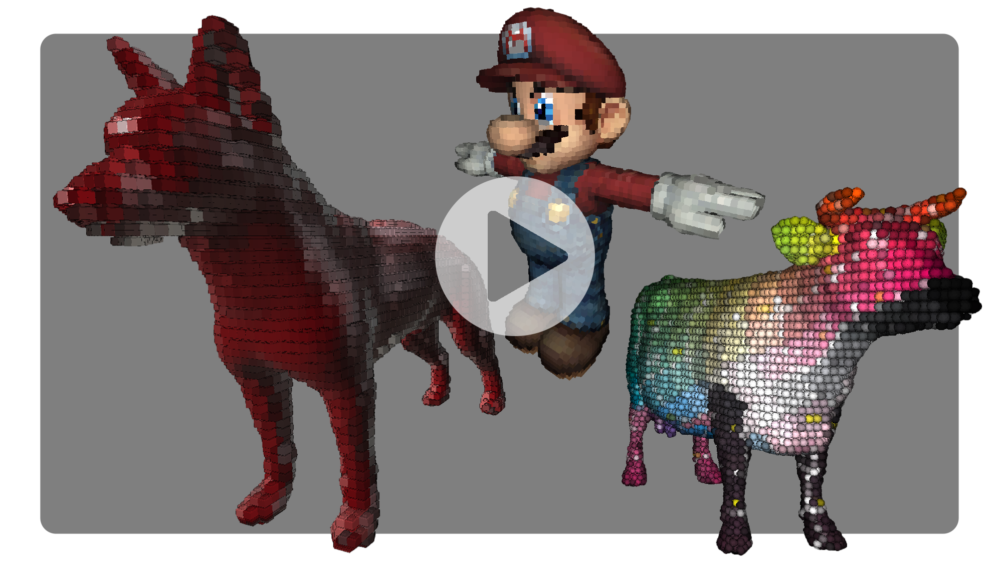

# ShaderFun + Instanced Voxelization Shader

This is an original personal project which expands dramatically upon a graphics pipeline project from my first computer graphics course at Penn (CIS 5600).

DEMO: 

This Qt app was implemented using C++ and OpenGL, and features a GUI offering many options for the 3 shader stages (typical surface shading of underlying mesh, instanced grid, and post-process), which can stack effects. This project first required a method for drawing grids of arbitrary instanced meshes. Once I had a handle on GPU instancing, I then implemented some unorthodox deferred shading techniques to cull geometry from these grids to fit an underlying model which is rendered fully in the first pass. I saved depth, color, and normal data from the first render pass to framebuffer textures which I then sample in the vertex shader (like I said, unorthodox) so that I may more easily discard full voxels.
I originally dreamt of this project because I have never seen an application of real-time 3D voxelization in games, despite seeing many examples of 2D pixel art/animation generated from coarsely rasterized 3D models. Because there weren't any references for exactly what I hoped to accomplish, I had to truly explore, experiment, and learn deeply. I had a blast breaking apart my existing shader pipeline and digging deep into what's possible with OpenGL.

I am pleased with the state of the project, but also know there are areas to improve. For one, I would like to perform the primitive culling operation in a geometry shader, rather than flagging vertices and discarding fragments later on. I also want to explore using position data from the first pass rather than depth which can be frustrating to use due to loss of precision from perspective diminishment, for example. One notable weak point of this real-time approach is that the voxels are culled using 2D data, which causes strange behavior around the edges of the mesh. I implemented an approach that discards geometry with normals which are near-orthogonal to the view vector and with a 2D-projected normal pointing towards a maximum-depth pixel in the depth texture (off the mesh), but found this didn't perfectly address the issue. Color flickering is another problem, and I addressed it with gaussian filtering which smooths the color sampled by each instanced mesh. However, I hope to find a more efficient method in the future.

