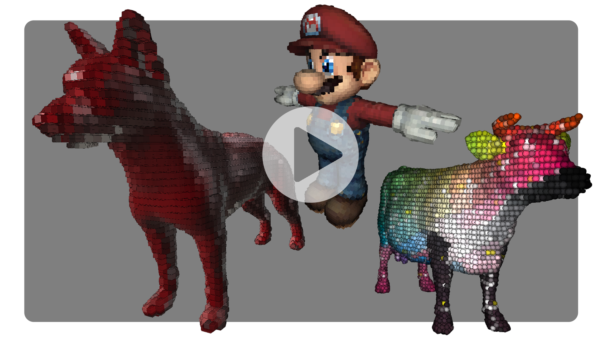

# ShaderFun + Instanced Voxelization Shader

This is a completely original personal project which expands dramatically upon an OpenGL shader pipeline project from my first computer graphics course at Penn (CIS 5610).

DEMO: 

